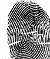

# Multimodal Biometric Dataset Collection

Available to researchers under the CITeR Database Release Agreement.

West Virginia University , Clarkson University.

Multimodal, multisite database for iris, face, face video and voice, fingerprint, hand geometry. Palmprint for over 500 subjects, multiple visits.

Set of datasets:
- [Multimodal Biometric Dataset Collection WVU - Release 1](https://citer.clarkson.edu/research-resources/biometric-dataset-collections-2/multimodal-biometric-dataset-collection-biomdata-release-1/)
- [Multimodal Biometric Dataset Collection WVU - Release 2](https://citer.clarkson.edu/biometric-dataset-collections/multimodal-biometric-dataset-collection-biomdata-release-2/)
- [Multimodal Biometric Dataset Collection CU- Release 2](https://citer.clarkson.edu/research-resources/biometric-dataset-collections-2/multimodal-biometric-dataset-collection-clarkson-university/)

See https://citer.clarkson.edu/research-resources/biometric-dataset-collections-2/ for more details.

### [Multimodal Biometric Dataset Collection WVU - Release 1](https://citer.clarkson.edu/research-resources/biometric-dataset-collections-2/multimodal-biometric-dataset-collection-biomdata-release-1/)

Please submit requests for the dataset unless otherwise indicated:

WVUBiometricData@mail.wvu.edu

First release of the biometric dataset collection contains image and sound files for six biometric modalities:

- Iris
- Face
- Voice
- Fingerprint
- Hand Geometry
- Palm Print

The dataset also includes soft biometrics such as height and weight, for subjects of different age groups, ethnicity and gender with variable number of sessions/subject.

| Biometric Modality | Device | # of Subjects | # of Files |
| :--- | :--- | :--- | :--- |
| Iris | [Irispass](https://citer.clarkson.edu/biometric-dataset-collections/iris-dataset/) | 231 | 3043 BMP, 3043 LOG |
| Fingerrpint | [SecuGen](https://citer.clarkson.edu/research-resources/biometric-dataset-collections-2/fingerprint-dataset/) | 270 | 7136 BMP |
| Palmprint | [HP Scanket](https://citer.clarkson.edu/research-resources/biometric-dataset-collections-2/palm-print-dataset/) | 263 | 673 BMP |
| Hand Geometry | [HandKey II](https://citer.clarkson.edu/research-resources/biometric-dataset-collections-2/hand-geometry-dataset/) | 219 | 2837 JPEG |
| Voice | [LogiTech](https://citer.clarkson.edu/research-resources/biometric-dataset-collections-2/voice-dataset/) | 240 | 640 WAV |
| Face | [Sony EVI-D30/31](https://citer.clarkson.edu/research-resources/biometric-dataset-collections-2/face-dataset/) | 111 | 557 BMP | 
| | | 205 | 1170 BMP |

#### Iris Dataset

OKI IRISPASS-h handheld device is used to capture the image of the iris. The user is asked to hold the device away from one eye (at a distance eyeglasses would be away from the face) while covering the other eye with the hand; the covered eye must remain open, so that the pictured eye does not squint. The user should be able to see all sides of the green box displayed on the screen of the biometric device. The software used is provided by the constructor of the biometric scanner. The size of the iris picture is 302 KB, 480×640 and 2 KB for the .log file that contains the setup parameters of the biometric scanner. Four images of each eye are taken during one session. At the discretion of the volunteer more data samples were acquired when subjectively was determined that the quality of the image was poor.

Examples of iris images:

#### Fingerprint Dataset

SecuGen optical fingerprint biometric scanner, 500 dpi, is used to capture the fingerprint images. The software used is our own implementation in JAVA programming language that allow us to collect single and time series images. Fingerprints are collected without controlling the quality and the centering of the finger and without cleaning the glass plate of the scanner between acquisitions. Image size is 72 KB, 292×248. Images of the thumb and index finger from both hands are taken in the following order: L1, R1 , L2 and R2. The subject is instructed to lift and replace their finger between each capture. Five images of each are taken. No substance is used to clean the finger.

Examples of fingerprint images:

#### Palmprint Dataset

Palm print images are captured with HP Scan Jet 4200C scanner device. The subject is instructed verbally how to place the hand inside the scanner without touching the glass or place lightly the hand on the screen, without applying any pressure on the glass. The fingers are spread naturally. Rings are not removed. One image is captured for each palm with the lid closed. The image size is 5.95 MB, 1730×1276×3. The platen is cleaned from time to time with alcohol.

#### Hand Geometry

The right hand image is captured using an IR Recognition Systems HandKey II biometric device. A Matlab program is used to read the top view image of the hand from the RSI to the computer. The size of the image is 20 KB, 660×768 and 2KB for the .log file. The subject is first enrolled into the system using a seven digit random identification number as the pass code. The subject is instructed how to enter his/her random identification number and how to place the hand on the platen, and then the image of the hand is captured six times.

Examples of hand geometry images:

#### Voice

Using a standard sound recorder Logitech, that does not filter out the background noise, the voice of the subject is captured twice, resulting in two files with extension .wav. The subject speaks at about six inches from the microphone and is asked to read a text composed of two short sentences followed by a set of numbers: My favorite sport is basketball , I love to support this research and 1, 6, 7, 2, 3, 0, 8, 7, 4, 5, 9, 1. The files are typically 10 to 25 seconds in length.

#### Face

Frontal images are collected indoor in a controlled scenarios, with uncluttered, white background. The subject is positioned at 2 meters from the camera. They are directed to look into the camera; no emotions are specified; eyeglasses are not removed. The only light used is that from the ceiling, ambient “office” lighting.

A SONY EVI D 30/31, using IC Standard Capture software captures the image. The size of the images is 1.26 MB, 576×768×3 or 900 KB, 480×640×3. There are two situations: using zoom in, the subject is framed from shoulders to top of the head or until face (from chin to hair) fits into the picture window. The subject is asked to stand up and sit back down again until the face is captured five times.

Examples of face images:

POLICY: Due to privacy issues related to identifying individuals, face data is not made available in combination with other subset of modalities, only as a single subset.

When using biometric collection, please cite: S. Crihalmeanu, A. Ross, S. Schuckers, L. Hornak, A Protocol for Multibiometric Data Acquisition, Storage and Dissemination, Technical Report, WVU, Lane Department of Computer Science and Electrical Engineering, 2007

### [Multimodal Biometric Dataset Collection WVU - Release 2](https://citer.clarkson.edu/biometric-dataset-collections/multimodal-biometric-dataset-collection-biomdata-release-2/)

Please submit requests for the dataset unless otherwise indicated:

WVUBiometricData@mail.wvu.edu

Second release of the biometric dataset collection contains image and video files for the following modalities:

- Iris
- Face
- Face video and voice
- Fingerprint
- Hand geometry
- Palmprint

The dataset also includes soft biometrics such as height and weight, for subjects of different age, ethnicity and gender with variable number of sessions/subject.

| Biometric Modality | Device | # of Subjects | # of Files |
| :--- | :--- | :--- | :--- |
| Iris | IrisPass | 72 | 763 BMP, 763 LOG |
| Fingerprint | CrossMatch | 71 | 1066 BMP |
| | SecuGen | 71 | 4327 BMP |
| | Precise Biometrics | 71 | 4327 BMP |
| Palmprint | HP Scanjet | 71 | 311 BMP |
| Hand Geometry | Handkey II  | 71 | 320 JPEG, 320 TXT |
| Face Video and Voice | Sony DCR-VX2100 | 71 | 307 AVI |
| Face | EVI-D30/31 | 70 | 306 BMP |

See the links from previous tables for a better understand of the device.

POLICY: Due to privacy issues related to identifying individuals, face data is not made available in combination with other subset of modalities, only as a single subset.

When using biometric collection, please cite: S. Crihalmeanu, A. Ross, S. Schuckers, L. Hornak, A Protocol for Multibiometric Data Acquisition, Storage and Dissemination, Technical Report, WVU, Lane Department of Computer Science and Electrical Engineering, 2007

### [Multimodal Biometric Dataset Collection CU- Release 2](https://citer.clarkson.edu/research-resources/biometric-dataset-collections-2/multimodal-biometric-dataset-collection-clarkson-university/)

Please contact citer@clarkson.edu for Clarkson data.

The biometric dataset collection contains image and video files for the following modalities:

- Iris
- Face
- Voice
- Fingerprint
- Palmprint

Subjects are of different age, ethnicity and gender with variable number of sessions/subject.

| Biometric Modality | Device | # of Subjects | # of Files |
| :--- | :--- | :--- | :--- |
| Iris | Irispass | 247 | 7629 |
| Fingerprint | CrossMatch | 281 | 39188 |
| | SecuGen | 291 | 24747 |
| | Precise Biometrics | 283 | 13300 |
| | Identix | 180 | 46350 |
| Palmprint | HP Scanjet | 290 | 3048 |
| Voice | Sony DCR-VX2100 | 286 | 3529 |
| Face | Canon PowerShot G6 | 278 | 3039 |

See the links from previous tables for a better understand of the device.

POLICY: Due to privacy issues related to identifying individuals, face data is not made available in combination with other subset of modalities, only as a single subset.

When using biometric collection, please cite: S. Crihalmeanu, A. Ross, S. Schuckers, L. Hornak, A Protocol for Multibiometric Data Acquisition, Storage and Dissemination, Technical Report, WVU, Lane Department of Computer Science and Electrical Engineering, 2007